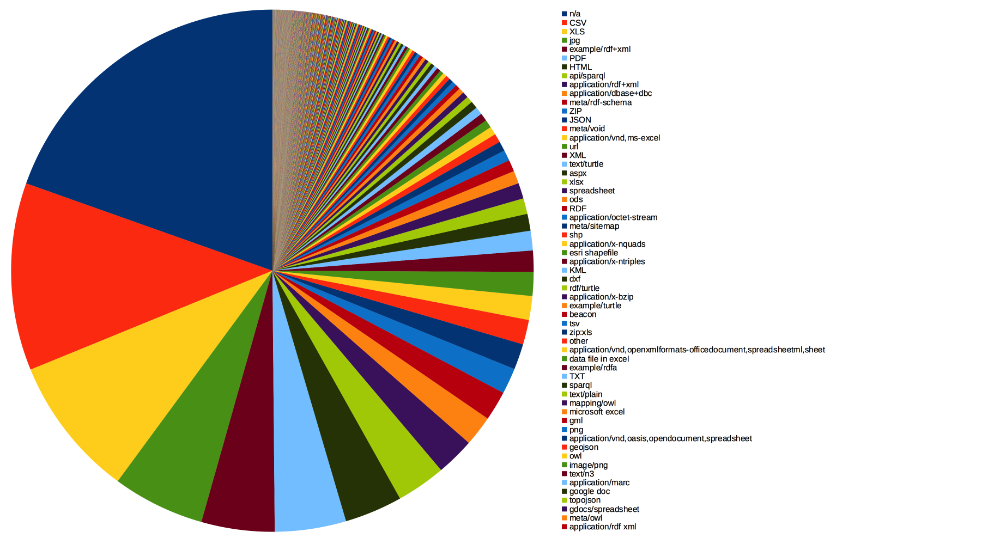
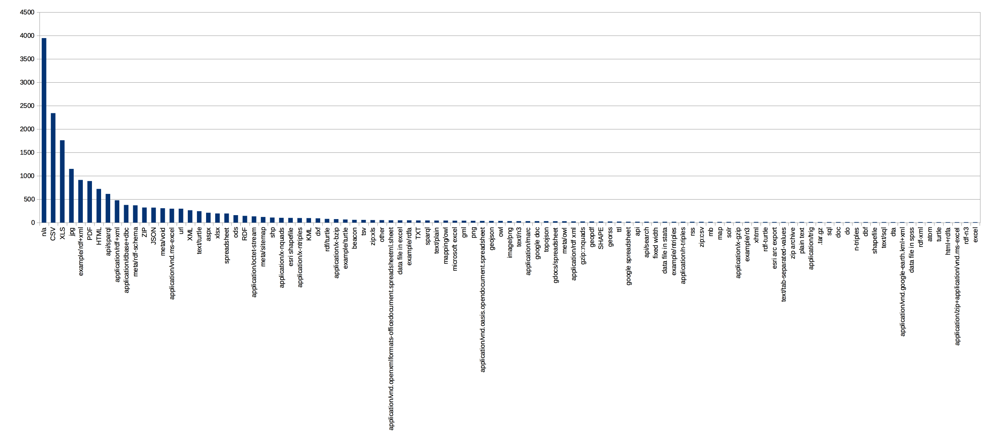
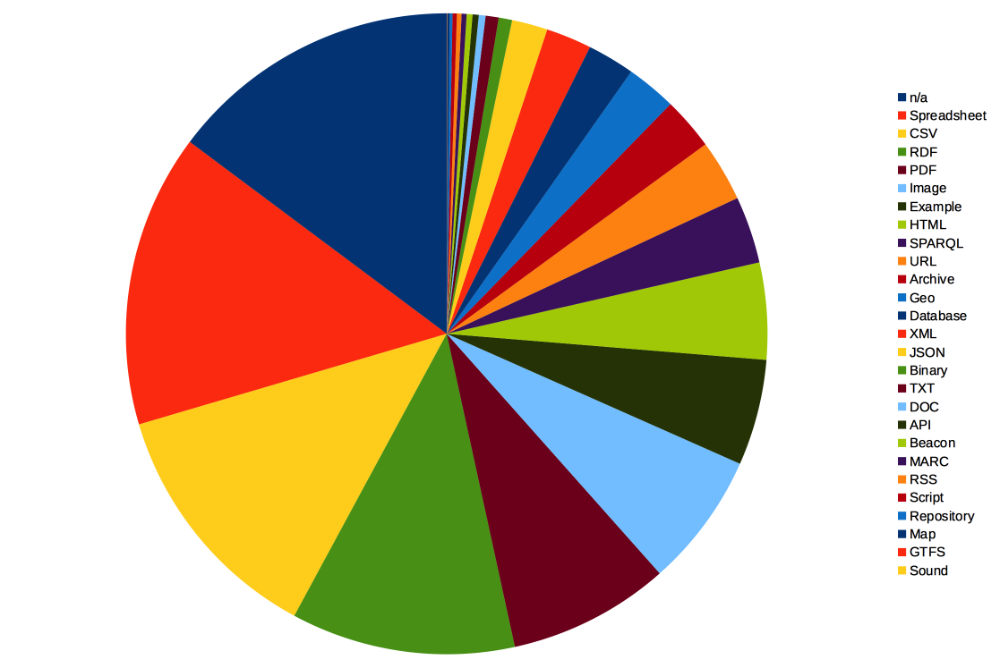
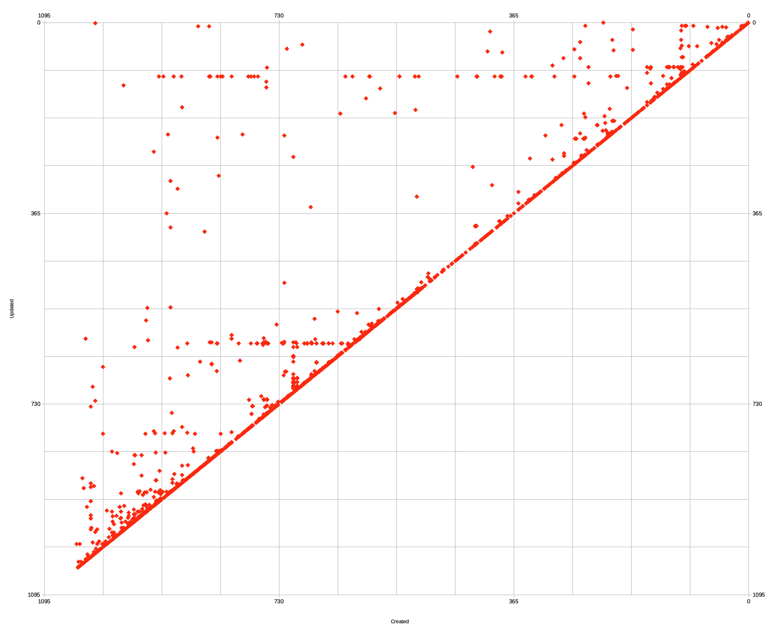
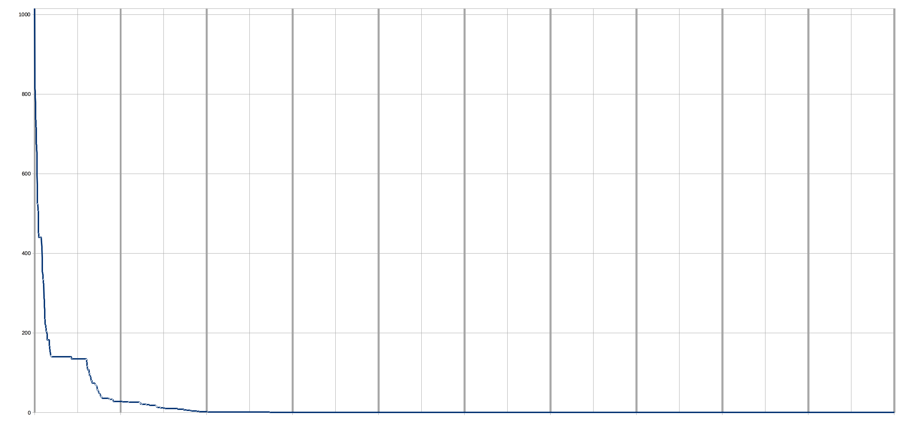
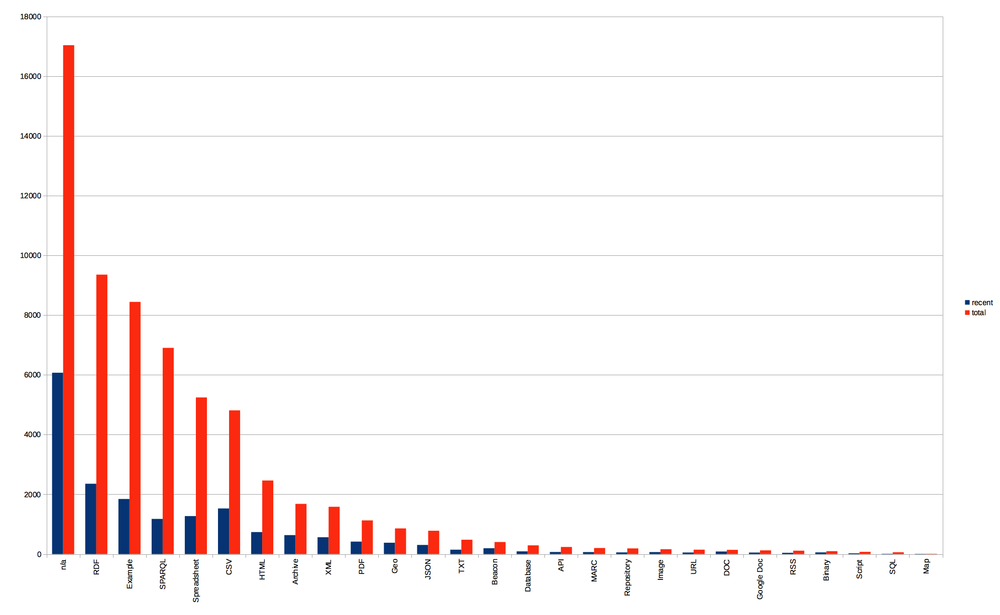
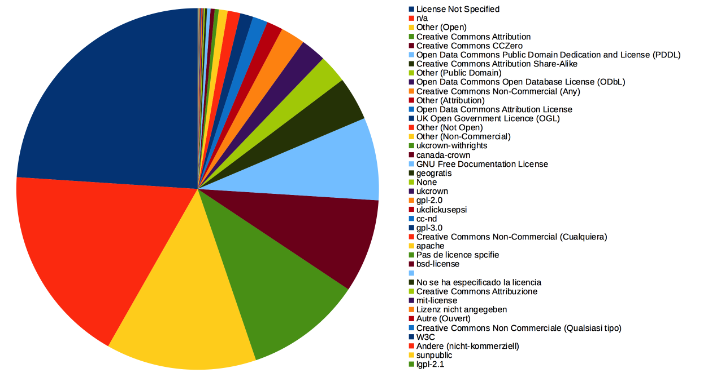

# CKANstats
... is a set of scripts to analyse CKAN-based data repositories. These are augmented by [LODprobe](https://github.com/heussd/lodprobe), a Java tool that does a further in-depth analysis of individual RDF-based datasets. In the following, this collection of tools is applied to [datahub.io](http://www.datahub.io).

## Setup
### 1. Retrieve meta data from CKAN-based data repositories
	CKANstats.py
You'll need to edit the source to change the data portal [CKANstats.py](CKANstats.py)
### 2. Load retrieved CSV into SQL (here: PostgreSQL)
	CREATE TABLE datahubio
	(
	  dataset_id character(36),
	  dataset_name character(1024),
	  dataset_license_title character(2014),
	  dataset_license_id character(255),
	  dataset_is_open boolean,
	  dataset_tracking_summary_total integer,
	  dataset_tracking_summary_recent integer,
	  resource_id character(36),
	  resource_name character(1024),
	  resource_created character(26),
	  resource_revision_timestamp character(26),
	  resource_format character(1024),
	  resource_url character(1024),
	  resource_tracking_summary_total integer,
	  resource_tracking_summary_recent integer
	)
	
	COPY datahubio FROM 'datahubio.csv' DELIMITER ',' CSV;
	
### 3. Start querying :)
	
## First impressions of datahub.io

### "format" row is not unified, about 20% w/o definition
	select trim(resource_format), (COUNT(resource_format)::double precision / (select COUNT(resource_format) from datahubio)::double precision * 100) as c from datahubio
	group by resource_format order by c desc

	select trim(resource_format), COUNT(resource_format) as count from datahubio
	group by resource_format order by count desc
	

### There are at least 29 variants for the format "Excel"

	select trim(resource_format), COUNT(resource_format) as count from datahubio
	where resource_format like '%xls%' or resource_format like '%excel%' or resource_format like '%openxml%.spreadsheet%'
	group by resource_format order by count desc

resource_format|count
-----|-----
application/vnd.ms-excel|298
xlsx|196
zip:xls|54
application/vnd.openxmlformats-officedocument.spreadsheetml.sheet|50
data file in excel|49
microsoft excel|41
application/zip+application/vnd.ms-excel|10
excel|10
application/zip+vnd.ms-excel|6
format-xls|6
xls (zip)|5
application/vnd.ms-excel.sheet.binary.macroenabled.12|4
ms excel csv|2
application/x-excel|2
csv stata excel|2
xls html pdf|2
data file in stata and excel|1
html xls|1
csv xls ods pdf mm|1
data file in excel and rdf|1
data file in excel and stata|1
csv and xls|1
csv xls m.fl.|1
html xls pdf|1
csv xls prn dbase med flere|1
xls csv|1
pdf / xls|1
xls html ascii|1
csv xls openoffice pdf mm|1

### The number of resources per datasets strongly varies
	select AVG(count), STDDEV(count), variance(count) from (
		select trim(dataset_name), COUNT(resource_id) as count from datahubio
		group by dataset_name order by count desc
	) as l

avg|stddev|variance
------|------|------
3.2128405289150868|13.2269114412110874|174.9511862736407655

### Majority of the datasets have exactly one resource file associated
	select count, count(count) from (
		select trim(dataset_name), COUNT(resource_id) as 		count from datahubio
		group by dataset_name order by count desc
	) as l group by count order by l.count
		

### Some of the 'n/a' formats might be retrieved from the resource_url

	select format, count(format) from (
		select UPPER(substring(trim(resource_url) from '...$')) as format 		from datahubio where resource_format = 'n/a'	
	) as i
	group by format order by count(format) desc

format|count
----|----
PDF|747
RG/|295
CES|250
KEY|247
TML|158
PHP|53
CSV|51
ZIP|49
HTM|47
COM|34
OM/|30
SPX|30
TA/|26
D=0|23
OV/|21
JSP|19
ATA|18
ONE|16
.GZ|15
ORG|14
ES/|13
RQL|13
RCH|12
SON|12
OAD|11
AU/|11
ER/|11
=EN|10
TXT|10
DU/|9
XLS|8

### 302 of the 'n/a'-format resources are accompanied by non-'n/a'-format resources 
	select count(id) from (
		select a.id
		from 
		(select distinct(trim(dataset_id)) as id from datahubio where resource_format = 'n/a' ) as a inner join
		(select distinct(trim(dataset_id)) as id from datahubio where resource_format <> 'n/a') as b on a.id = b.id
	) as i
	
count|
-----|
302|

## Correct the mess

The mission is bascially: use a mapping table that assignes the various values stated in the resource_format-column to unified format definitions. For example, the following expressions assign the data format ``Spreadsheet``:

format|expr
----|----
Spreadsheet|%openxmlformats%spreadsheetml%
Spreadsheet|%ods%
Spreadsheet|spreadsheet
Spreadsheet|%xls%
Spreadsheet|%xls
Spreadsheet|%xlsx%
Spreadsheet|%xlxs
Spreadsheet|*ods
Spreadsheet|%excel%
Spreadsheet|%openoffice%calc%
Spreadsheet|%spreadsheet

The entire mapping table is handcrafted and [available here](mptbl.csv). This table is used (left outer joined) twice:

1. First, the format definition of datahub.io (``resource_format``) is translated via SQL-like-patterns: ``left outer join mptbl as a on lower(trim(resource_format)) like lower(a.expr)``
1. Second, in the great tradition of [desperate modes](https://twitter.com/philae_mupus/status/533694420290633728), for every undefined format, try to join the mapping table an additional time based on the last characters of the resource URL (``resource_url``) - this eliminates about 1/4 of the n/as :) ``left outer join mptbl as b on (a.format = 'n/a' and lower(substring(trim(resource_url) from '...$')) like b.expr)``

The final view then selects any null-valued format:

	drop view datahubio2;;
	create view datahubio2 as
	select dataset_id, dataset_name, dataset_license_title, dataset_license_id, 
	   dataset_is_open, dataset_tracking_summary_total, dataset_tracking_summary_recent, 
	   resource_id, resource_name, resource_created, resource_revision_timestamp, 
	   resource_format, resource_url, resource_tracking_summary_total, 
	   resource_tracking_summary_recent, trim(coalesce(b.format, a.format, 'n/a')) as unified_format, trim(coalesce(b.star, a.star, 'n/a')) as star from datahubio
	left outer join mptbl as a on lower(trim(resource_format)) like lower(a.expr)
	-- desperate mode: try to map unknown formats via possible resource_url-extensions
	left outer join mptbl as b on (a.format = 'n/a' and lower(substring(trim(resource_url) from '...$')) like b.expr)	

## Insights in unified data
### Format distribution

	select unified_format, count(unified_format) as count, count(unified_format)::double precision / (select count(unified_format) from datahubio2)::double precision from datahubio2
	group by unified_format order by count(unified_format) desc
	

unified_format|count|%
----|----|----
n/a|2983|14.78%
Spreadsheet|2983|14.78%
CSV|2533|12.55%
RDF|2279|11.29%
PDF|1643|8.14%
Image|1371|6.79%
Example|1079|5.35%
HTML|985|4.88%
SPARQL|682|3.38%
URL|627|3.11%
Archive|534|2.65%
Geo|511|2.53%
Database|481|2.38%
XML|463|2.29%
JSON|364|1.80%
Binary|137|0.68%
TXT|132|0.65%
DOC|69|0.34%
API|63|0.31%
Beacon|59|0.29%
MARC|51|0.25%
RSS|47|0.23%
Script|44|0.22%
Repository|28|0.14%
Map|25|0.12%
GTFS|3|0.01%
Sound|2|0.01%

### About openness

	select unified_format, open, nonopen, round((open::double precision / (open::double precision + nonopen::double precision) * 100)::numeric, 2) from (
	select t.unified_format, coalesce(t.count, 0) as open, coalesce(f.count, 0) as nonopen from 
	(select unified_format, count(unified_format) as count from datahubio2
	where dataset_is_open = true group by unified_format ) as t
	left outer join 
	(select unified_format, count(unified_format) as count from datahubio2
	where dataset_is_open = false group by unified_format ) as f on (f.unified_format = t.unified_format)
	) as i order by (open::double precision / (open::double precision + nonopen::double precision)) desc

unified_format|open|non-open|% openness
----|-----|-----|----
MARC|51|0|100.00
GTFS|3|0|100.00
Beacon|58|1|98.31
Image|1227|144|89.50
URL|535|92|85.33
RDF|1725|554|75.69
RSS|34|13|72.34
JSON|259|105|71.15
SPARQL|472|210|69.21
API|43|20|68.25
Map|17|8|68.00
Binary|87|50|63.50
Geo|313|198|61.25
XML|273|190|58.96
n/a|1758|1225|58.93
CSV|1490|1043|58.82
Repository|16|12|57.14
Archive|292|242|54.68
Example|541|538|50.14
Script|22|22|50.00
DOC|34|35|49.28
TXT|57|75|43.18
HTML|398|587|40.41
Spreadsheet|640|2343|21.45
PDF|224|1419|13.63
Database|43|438|8.94

### Data Classified in TBL's 5-Star Maturity Model

	select star, count(star) as count, count(star)::double precision / (select count(star)
	from datahubio2 where dataset_is_open = true)::double precision from datahubio2 where dataset_is_open = true
	group by star order by star

5-star rating|count|percent
----|----|----|
1|2702|25,46%
2|658|6,20%
3|2506|23,61%
4|2197|20,70%
n/a|2549|24,02%

### Created vs. Timestamp, Ages in days
	select resource_id, round(EXTRACT('epoch' FROM created)/86400) created, round(EXTRACT('epoch' from a.updated)/86400) as updated from (
	select datahubio2.resource_id,
		age(to_timestamp('2015-03-10 13:46:00.000000', 'YYYY-MM-DD HH24:MI:SS.US'),
			to_timestamp(resource_created, 'YYYY-MM-DD HH24:MI:SS.US')) as created,
		age(to_timestamp('2015-03-10 13:46:00.000000', 'YYYY-MM-DD HH24:MI:SS.US'),
			to_timestamp(resource_revision_timestamp, 'YYYY-MM-DD HH24:MI:SS.US')) as updated
		from datahubio2
	where datahubio2.resource_created <> 'n/a'
	) as a order by created

### Last update after release: 10% within ~50 days, ~7% after ~150 days or more, 80% is never updated

	select resource_id, (round(EXTRACT('epoch' FROM created)/86400) - round(EXTRACT('epoch' from a.updated)/86400)) diff from (
	select datahubio2.resource_id,
		age(to_timestamp('2015-03-10 13:46:00.000000', 'YYYY-MM-DD HH24:MI:SS.US'),
			to_timestamp(resource_created, 'YYYY-MM-DD HH24:MI:SS.US')) as created,
		age(to_timestamp('2015-03-10 13:46:00.000000', 'YYYY-MM-DD HH24:MI:SS.US'),
			to_timestamp(resource_revision_timestamp, 'YYYY-MM-DD HH24:MI:SS.US')) as updated
		from datahubio2
	where datahubio2.resource_created <> 'n/a'
	) as a order by (round(EXTRACT('epoch' FROM created)/86400) - round(EXTRACT('epoch' from a.updated)/86400)) desc
	
	

### Average Days between Created and Last Update, per format
	select unified_format,
		round(avg(round(EXTRACT('epoch' FROM created)/86400) - round(EXTRACT('epoch' from a.updated)/86400))::numeric, 2) average_created_updated_diff,
		round(stddev(round(EXTRACT('epoch' FROM created)/86400) - round(EXTRACT('epoch' from a.updated)/86400))::numeric, 2) stdev_created_updated_diff
	from (
	select datahubio2.unified_format,
		age(to_timestamp('2015-03-10 13:46:00.000000', 'YYYY-MM-DD HH24:MI:SS.US'),
			to_timestamp(resource_created, 'YYYY-MM-DD HH24:MI:SS.US')) as created,
		age(to_timestamp('2015-03-10 13:46:00.000000', 'YYYY-MM-DD HH24:MI:SS.US'),
			to_timestamp(resource_revision_timestamp, 'YYYY-MM-DD HH24:MI:SS.US')) as updated
		from datahubio2
	where datahubio2.resource_created <> 'n/a'
	) as a group by unified_format order by average_created_updated_diff desc

unified\_format|average\_created\_updated\_diff|stdev\_created\_updated\_diff
----|----|----
Image|81.89|65.72
Archive|56.63|123.91
API|52.76|154.96
SPARQL|40.38|118.51
RSS|28.80|14.50
TXT|28.37|82.42
Example|21.97|98.39
HTML|18.33|105.33
n/a|18.29|87.06
RDF|16.78|78.40
XML|16.32|86.99
PDF|13.16|31.03
Beacon|12.00|7.07
JSON|10.18|32.91
Binary|9.98|61.66
Map|9.82|32.56
CSV|4.58|36.22
Script|2.67|2.58
Spreadsheet|1.97|25.03
DOC|1.58|2.95
Geo|1.09|9.38
URL|0.76|13.60
SQL|0.43|0.53
Database|0.30|2.59
Google Doc|0.00|
MARC|0.00|0.00
Repository|0.00|0.00
GTFS|0.00|0.00

### Recent & total visits per format

	select a.unified_format, a.count as recent, b.count as total from (
	select unified_format, sum(resource_tracking_summary_recent) as count from datahubio2
	where resource_tracking_summary_recent > 0
	group by unified_format order by sum(resource_tracking_summary_recent) desc
	) as a left outer join (
	select unified_format, sum(resource_tracking_summary_total) as count from datahubio2
	where resource_tracking_summary_total > 0
	group by unified_format order by sum(resource_tracking_summary_total) desc ) as b
	on a.unified_format = b.unified_format
	order by total desc
	

### Licences

	select trim(dataset_license_title), count(dataset_license_title) from datahubio2
	group by dataset_license_title order by count(dataset_license_title) desc
	

	

## Per-Resource Evaluations

### Top 50 Linked Data resources
	select distinct trim(dataset_name), trim(resource_name),trim(resource_url), resource_tracking_summary_total from datahubio2
	where unified_format = 'Linked Data' order by resource_tracking_summary_total desc